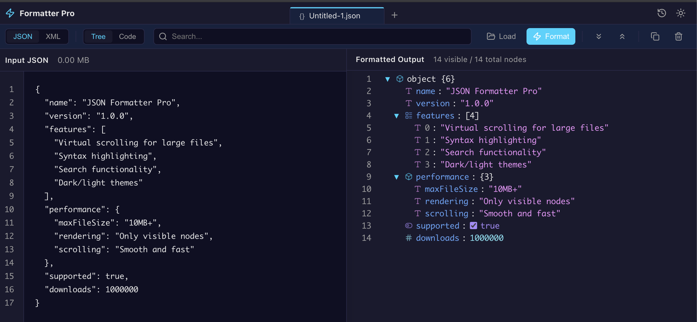

# JSON/XML Formatter Pro

A high-performance web application for formatting and visualizing large JSON and XML files (10MB+).

**[Live Demo](https://parse.yorhanet.app)**

## 📸 Screenshots

<div align="center">

### JSON Formatter with Tree View

*Interactive tree view with syntax highlighting, collapsible nodes, and search functionality*

### XML Formatter with Tree View

*XML parsing with attribute support (@id) and hierarchical visualization*

</div>

## ✨ Features

- **Dual Format Support**: Full JSON and XML parsing/formatting.
- **Virtual Scrolling**: Renders only visible nodes, enabling smooth performance with massive files (tested with 19MB+).
- **Web Worker Processing**: Background parsing prevents UI freezing.
- **Search & Navigation**: Search keys, values, and paths with instant navigation and auto-expansion.
- **Dual Views**: Switch between interactive Tree View and professional Monaco Editor Code View.
- **Monaco Editor Integration**: Full-featured code editing with VS Code-like experience (minimap, folding, syntax highlighting).
- **Theme Support**: Dark and Light modes.
- **Auto-Formatting**: Smart debounced formatting as you type.

## 🚀 Getting Started

### Installation

```bash
npm install
```

### Development

```bash
npm run dev
```

### Build

```bash
npm run build
```

## 🏗️ Architecture

- **React 18 & TypeScript**: Modern, type-safe codebase.
- **Vite**: Fast build tool.
- **Monaco Editor**: Industry-standard code editor for input and code view.
- **react-window**: Efficient virtual scrolling for tree view.
- **Web Workers**: Offloads heavy parsing to background threads.
- **Map-based Lookups**: O(1) search performance.

## 📝 Usage

1.  **Select Format**: Toggle between JSON and XML.
2.  **Input**: Paste content or load a file.
3.  **View**: Explore via Tree or Code view.
4.  **Search**: Find and navigate matches instantly.

## 📄 License

MIT License
